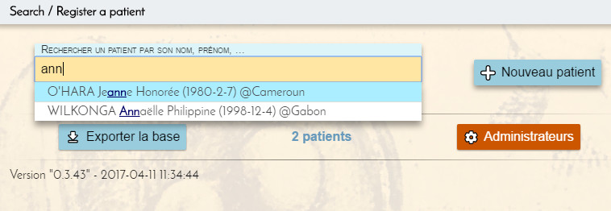
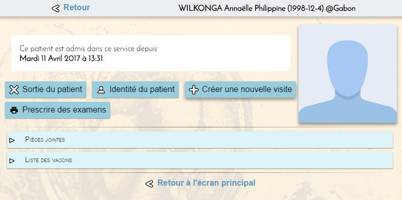
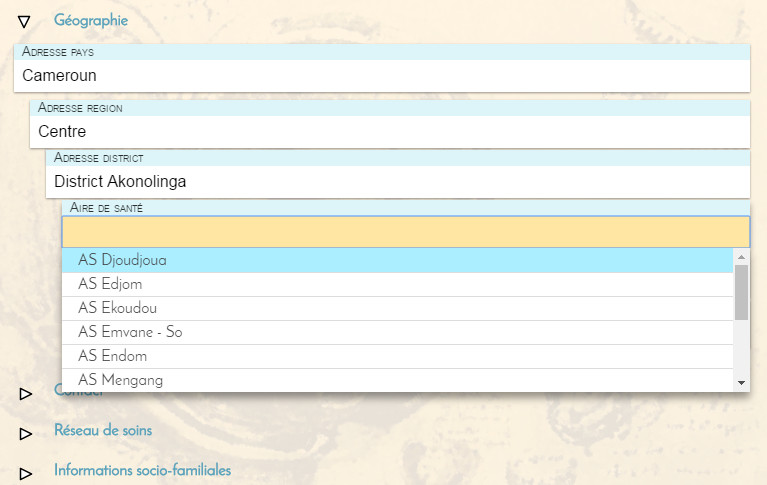

# Cameroun

Système de saisie de consultations médicales





# Installation

Ce logiciel utilise le runtime __[NW.io](https://nwjs.io/)__. Inutile de télécharger la version __SDK__ sauf si vous désirez modifier le code.

Une fois installé, assurez-vous que le programme `nw` (`nw.exe` sous Windows) est dans le PATH système.

Télécharger et décompresser [cette archive](https://github.com/tolokoban/tlk-app-shell/archive/gh-pages.zip) dans le répertoire de votre choix.

Vous allez obtenir un répertoire nommé `tlk-app-shell-hp-pages` que vous pouvez renommer comme bon vous semble.
Ouvrez un terminal dans ce répertoire puis tapez :
```
nw .
```

Au premier démarrage, le programme vous demande _l'URL du dépôt_.
C'est l'adresse du site qui contient les mises à jour de l'application Cameroun.
* Version stable: `https://tolokoban.org/Cameroun/index.php`
* Version beta : `https://tolokoban.org/Cameroun/beta/index.php`

Le dépôt n'est demandé qu'une seule fois. Si vous voulez en changer, il faut cliquer sur le cercle vert (ou rouge) qui précède le nom de l'application à gauche dans le bandeau noir du haut.

# Compilation

Si vous êtes développeur, vous pouvez récupérer les sources comme ceci :
```
git clone https://github.com/tolokoban/cameroun.git
cd cameroun
npm update
```

Il vous faut donc [git](https://git-scm.com/) et [nodejs](https://nodejs.org).

Il y a deux façons de compiler :
* Mode __debug__ : `npm run watch`  
  Dans ce mode, la compilation se fait en continu à chaque modification de fichier source.
* Mode __release__ : `npm run release`  
  Dans ce mode, la compilation se fait une seule fois, le numéro de version est incrémenté et la taille du résultat est la plus petite possible.

Le résultat se trouve alors dans le sous-répertoire `www/`.
Et vous pouvez l'exécuter comme ceci :
```
nw www/
```

# Publication

Pour publier votre application, il faut déposer les fichiers suivants (__et uniquement ceux-là__) dans votre dépôt :
* `admin.html`
* `error.html`
* `icon-128.png`
* `icon-512.png`
* `index.html`
* `manifest.webapp`
* `package.json`
* `tfw/svc.php`

Ajoutez-y aussi les répertoires suivants, mais pas d'autres pour en pas écraser les données de la base commune :
* `css/`
* `js/`
* `tfw/php`
* `tfw/svc`

# Créer un dépôt

Un dépôt est un répertoire sur un serveur voir avec PHP 5.0 minimum.
Il doit posséder au moins le fichier suivant : [`index.php`](src/index.php).

# Documentation technique

## La base de données

Les données sont stoquées dans des fichiers dans le répertoire `data/`.
Il y a un seul fichier et autant de répertoires que de patients enregistrés.
Ces répertoires ont comme nom l'identifiant unique du patient dont ils
renferment les données.

L'unique fichier est `data/patients.json`. Il est au format JSON avec les attributs `count` (nombre de patients) et `records` (dictionnaire des patients).

Voici un exemple :
```
{
    "count": 4,
    "records": {
        "jlug": {
            "#PATIENT-LASTNAME": "Boure",
            "#PATIENT-FIRSTNAME": "amandine",
            "#PATIENT-GENDER": "#F",
            "#PATIENT-BIRTH": "1900-01-01",
            "#PATIENT-SIZE": "189",
            "#PATIENT-COUNTRY": "#NAT-ZM"
        },
        "jlyR": {
          ...
        },
        ...
    }
}
```

### Les patients


